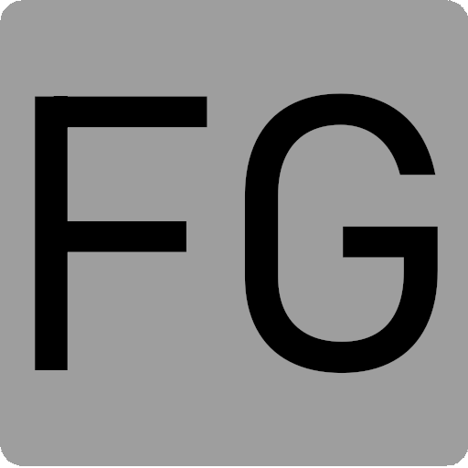

### Hi there 👋, my name is Felipe Godoi
#### I am Full Stack Developer

I have 4+ years of experience working primarily with Angular and Node.js technologies. Extensive experience with relational databases. Enthusiastic about artificial intelligence technologies. BSc. in Computer Engineering (IFTM) and pursuing a Postgraduate Degree in Distributed Software Architecture (PUC Minas) and a Postgraduate Degree in Blockchain Development (UniFECAF).

Skills: Angular / Nodejs / SQL / Typescript 

- 🔭 I’m currently working on Web Development. 
- 🌱 I’m currently learning Blockchain and Solidity. 
- 📫 How to reach me: [my site](https://godoi.dev) 

